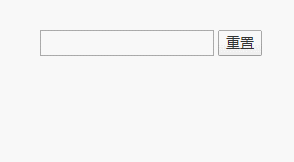
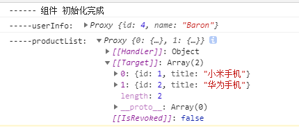
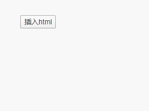
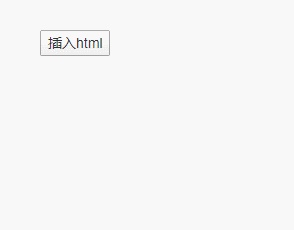

# easypage
>  一款轻量级的mvvm前端框架，支持es6 class 的面向对象方式进行开发，让你从繁琐的dom操作中解放，并提高代码的可读性，支持IE9+以上浏览器。


## 为什么是它

对于mvvm框架，vue大家肯定不陌生，既然有了这么优秀的vue，那为啥还需要开发这款框架呢？

- vue固然是强大的，但有时候我们做一些简单的页面，如纯展示的页面，只是少量的表单需要填写（如收集资料），这个时候你若引入vue来做数据绑定，就显得杀鸡用牛刀了（不，这是一把青龙偃月刀）。

- 基于我们现有的脚手架已经集成了jquery，如果再加上vue的话，体积会变得更大，那会影响页面加载的速度。

- easyPage对于服务器端渲染的页面，可以使用反向赋值。什么是反向赋值，就是你在前端里面定义的变量，可以自动读取服务器端渲染的内容进行赋值。结合egg框架是非常有利的。

- easyPage使用es6 class 的方式进行开发，如果你想尝试使用面向对象+组件式的开发体验，这款框架你一定不能错过。


## 适用场景

假如你的页面并复杂，特别是活动页，频道页，页面交互并不复杂，特别是多个页面之间并没有太大的关联。这时你可以easyPage来加快你的开发效率。若你一开始用的jquery，后来想加入类似vue的数据驱动功能，但不想引入整个vue，此方案亦可。后期有需要可以改成不依赖jquery的，这样连jquery也不需要引入，对于移动端项目那是非常轻量了。


## 快速开始

```shell
npm i easypage or yarn add easypage
```
下面举一个简单的输入框例子，演示数据驱动
```html
<div id="app">
    <input type="text" v-model="message" /> <button v-on="click=reset()">重置</button>
    <div v-text="message"></div>
  </div>
```

```js
import { EasyPage, $init } from 'easypage';

@$init({
  // 需要编译的节点
  $el: '#app'
})
export default class extends EasyPage {
  message = '';

  inited () {
    console.log('------ 组件 初始化完成');
  }

  reset () {
    this.message = '';
  }
}
```




代码就是这么简单，就完成了双向绑定。在es6 的class中声明了一个变量`message`，在页面中使用`v-text="message"`把需要绑定的dom元素标记起来，一般message有变化，元素内的文本就会随之变化。`v-on="click=reset()"`这个表示元素触发click事件会调用class中的reset方法，看到v-on这个属性就知道是事件绑定，跟vue的事件绑定写法略有不同，注意不要写错了。class中还定义了一个`inited`方法，这个表示组件初始化完成的钩子函数，暂时也就只有这个钩子，后期有需要可以添加更多。

可以看到代码里面有这么一行`export default class extends EasyPage`，直接导出一个class，脚手架可以自动读取并实例化，这个也是这个页面的入口class。

## 简单教程
easyPage的用法跟vue非常相似，假如你有vue的基础，10分钟即可完成掌握。

### 反向赋值

假如现在页面已经在node端渲染好了，能否有办法把渲染好的内容赋值到class中的定义好变量。当然，我们用jquery来遍历dom元素，然后逐个赋值给变量这也没问题，不过我们有更加优雅的方式。下面演示一段egg渲染+反向赋值的例子：

controller:

```js
async homeIndexPage () {
    const ctx = this.ctx;
    const userInfo = { id: 4, name: 'Baron' };
    const productList = [{ id: 1, title: '小米手机' }, { id: 2, title: '华为手机' }];
    await ctx.render('home/home.html', { userInfo, productList });
}
```

html:

```html
<div id="app">
    <h2 v-data="userInfo.id={{ userInfo.id }}" v-text="userInfo.name">{{ userInfo.name }}</h2>
    <ul>
        
        <li v-array="productList">
            <span v-data="productList[{{ loop.index0 }}].id={{ item.id }}" >{{ loop.index0 }}</span>
            .
            <span v-text="productList[{{ loop.index0 }}].title">{{ item.title }}</span>
        </li>
        
    </ul>
</div>
```

egg渲染以后:

```html
<div id="app">
    <h2 v-data="userInfo.id=4" v-text="userInfo.name">Baron</h2>
    <ul>
        <li v-array="productList">
            <span v-data="productList[0].id=1" >0</span>
            .
            <span v-text="productList[0].title">小米手机</span>
        </li>
        <li v-array="productList">
            <span v-data="productList[1].id=2" >1</span>
            .
            <span v-text="productList[1].title">华为手机</span>
        </li>
    </ul>
</div>
```

反向赋值就是通过`[v-text], [v-array], [v-data], [v-model]`这几个属性来标记起来，然后easyPage会读取这部分的内容赋值到class中的变量中。v-text会把元素内的文本赋值给属性内的变量，如`userInfo.name`，然后执行`userInfo.name = 'Baron'`，v-model就会读取input中的value属性然后赋值，这很容易理解。主要讲下v-array和v-data。

easyPage会读取v-array中的值，然后遍历v-array元素内的**子元素**，如上面的v-array所在的li子元素中有`v-text="productList[0].title"`，则会执行`productList[0].title='小米手机'`，v-array会先初始化数据的数量，然后才会执行赋值。

而v-data就是直接执行里面的表达式，如`productList[1].id=2`，一般用在一些没有显示在页面上的内容，可是你又确实需要用到的变量。

规定：

1.反向赋值的变量，必须要在前端class中先声明好变量名，这样也有利于代码的可读性。

2.数组的反向赋值，需要用v-array进行标记，用于初始化数量。

在class中声明变量：

```js
// 一定要先声明变量，不然赋值时找不到变量名会报错
userInfo = {
    id: '',
    name: ''
};
productList = [];
constructor () {
    // 构造函数中，通过isAssign=true开启反向赋值
    super({ isAssign: true });
}
```

初始化完后：




### 模板动态编译

easyPage支持对一段HTML代码进行编译，然后插入到页面中，我们可以利用此功能做一些动态dom的插入，并支持数据的响应，如弹窗、ajax获取数据后动态渲染html等。

html模板：

```html
<!-- template.html -->
<div class="content">
  <h2 v-text="userInfo.name"></h2>
  <ul>
    <li v-for="(item, index) in productList">
      <span v-text="index"></span>
      .
      <span v-text="item.title"></span>
    </li>
  </ul>
</div>
```
js部分：

```js
import template from './template.html';

// 变量声明
userInfo = { id: 4, name: 'Baron' };
productList = [{ id: 1, title: '小米手机' }, { id: 2, title: '华为手机' }];
// ...
// $compile 方法用于编译html
insert () {
    const html = this.$compile(template);
    this.$el.find('.main').append(html);
}
// ...
```

主体页面html：

```html
<div id="app">
    <button v-on="click=insert()">插入html</button>
    <div class="main"></div>
</div>
```

效果如下：




### 子组件

easyPage支持通过es6 class + html模板的方式来封装组件。跟动态模板编译类似，只是在声明class的时候通过es6的装饰器来将class和template进行绑定，同时也支持父组件传递数据到子组件。

修改了一下上面的html模板：

```html
<div class="content">
  <h2 v-text="userInfo.name"></h2>
  <div><button v-on="click=addItem()">添加</button></div>
  <ul>
    <li v-for="(item, index) in productList">
      <span v-text="index"></span>
      .
      <span v-text="item.title"></span>
    </li>
  </ul>
</div>
```

子组件：

```js
import { EasyPage, $init, $on } from 'easypage';
import template from './template.html';

@$init({
  template: template
})
class Content extends EasyPage {
  // 父组件传入到子组件的属性，需要显式声明  
  static propTypes = {
    productList: Array
  }
  userInfo = { id: 4, name: 'Baron' };
  constructor (prop) {
    // EasyPage的构造函数中的prop参数为接收父组件传入的属性  
    super({ prop });
  }

  addItem () {
    // 可以使用$emit来调用父组件的方法  
    this.$emit('addItem');
  }

  show (param) {
    console.log(`打印: ${param}`);
  }  
}
```

父组件js:

```js
insert () {
    // $mount把子组件Content挂载到父组件中，其中this参数为父组件的this引用
    // $mount方法第三个参数为选项，若传入name参数，这样父组件可以通过this.$children[name]来访问子组件中的方法
    new Content({ productList: this.productList }).$mount(this, this.$el.find('.main'), { name: 'content' });
    // 调用子组件的方法
    this.$children.name.show(1111); // 打印：1111
}

// 通过$on装饰器，把addItem方法声明为自定义事件，其中'addItem'参数为事件名称
@$on('addItem')
addItem () {
    this.productList.push({ id: 3, title: '诺基亚手机' });
}
```

效果如下：



从上面的案例可以看到父组件把`this.productList`传入到子组件中，并且通过`$emit`来跟父组件进行通信。除此以外，还可以通过在子组件中的`this.$parent`来访问父组件的this引用，这样就可以调用`this.$parent.addItem()`达到同样效果。

若在`$mount`方法中传入`name`参数，这样父组件可以通过`this.$children[name]`来访问子组件中的方法。
规定：

子组件不能修改父组件中传入的prop，保证单向数据流。

父子组件间（甚至是兄弟组件）的通信可以通过$on和$emit来实现，具体api请看下面。

动态组件不支持反向赋值。


### 子组件prop的属性声明

在easypage里，子组件的prop属性必须要显式声明才有效果，不然父组件传进来也不作数。prop显式声明能让组件的使用者清楚有哪些选项可用，传递的参数类型和说明等。
对于组件的开发者也更加有利于后期的维护，代码的可读性更高。

```js
// 子组件
class Content extends EasyPage {
  // 一定要用 static 静态类型来定义  
  static propTypes = {
    // 基础的类型检查 (`null` 和 `undefined` 会通过任何类型验证)
    propA: String,
    // 多个可能的类型
    propB: [String, Number],
    // 必填的字符串
    propC: {
      type: String,
      required: true
    },
    // 带有默认值的数字
    propD: {
      type: Number,
      default: 100
    },
    // 不做类型检测，只有默认值
    propE: {
      default: []
    }
  };

  constructor (prop) {
    // EasyPage的构造函数中的prop参数为接收父组件传入的属性  
    super({ prop });
  }

}

// 父组件
class Parent extends EasyPage {
  dataA = 'dataA';
  propB = ['hello']; 
  inited () {
      // 当父组件和子组件传递的属性名不一致时，通过['父组件属性名:子组件属性名']来作为映射，若同名时，只需要传入子组件属性名即可
      new Content({ 'dataA:propA': this.dataA, propB: propB });
  }
}
```

### ~~数组和对象不要直接赋值~~ <b style="color:orange;">现在已经支持数组和对象的直接赋值！</b> :v: :wave:

代码进行一轮优化以后，已经支持数据和对象的直接赋值，使用Object.defineProperty+es6的Proxy对象进行处理。只是要注意一点，就是数组的concat方法：

```js
// 一开始声明的属性
this.list = ['a', 'b', 'c'];
// 错误的做法，concat之后不能赋值给原本的变量，会报错
this.list = this.list.concat(['d']);
// 正确做法，等价于上面
this.list.push(...['d']);

```

### demo

代码示例在 https://github.com/baronhuang/egg-multiple-page-example 项目上，访问路径：/demo/easypage


## API

### 实例方法

**$compile (template)**

- 参数：
  
  - {string|HTMLElement} template 需要编译的模板，可以是html元素
  
- 用法：

  编译html模板，使其变成可供框架操控的元素。

```js
const html = this.$compile(template);
this.$el.find('.main').append(html);
```


**$mount (parentThis, slot, type = 'append')**

- 参数：
  - {Object} parentThis 父组件的this引用
  - {HTMLElement} slot 父组件中的挂载点元素
  - {Object} options 选项
    - {string} options.type 挂载的方式，append(默认): 挂载到组件内部, replace: 替换挂载点
    - {string} options.name 组件的名称，父组件可通过this.$children[name]来访问
- 用法：
  把子组件挂载到父组件。

```js
new Content({ productList: this.productList }).$mount(this, this.$el.find('.main'));
```


**$on (event, callback)**

- 参数：
  - {string} event 事件名称
  - {Function} callback 事件回调
- 用法：
  自定义事件，可以用于子组件通信父组件，或者是兄弟组件通信。

```js
this.$on('addItem', this.addItem);
```


**$emit (event, data = null)**

- 参数：
  - {string} event 事件名称
  - {*} data 需要传入事件回调的参数
- 用法：
  触发自定义事件。

```js
this.$emit('addItem');
```


### 内置指令

**v-text**

把数据渲染成dom元素的文本。支持反向赋值。

```html
<span v-text="message"></span>
```


**v-for**

常用用于数组中，遍历数组属性，根据数组中的字段渲染dom。其中item=数组中的元素，index=数组索引。记得里面的括号`()`不能丢。

```html
<li v-for="(item, index) in productList">
    <span v-text="index"></span>
    <span v-text="item.title"></span>
</li>
```


**v-array**

仅用于反向赋值。读取服务器端已经渲染好的HTML，根据子元素的`v-text`，`v-model`，`v-data`等属性对组件class声明好的变量进行赋值。

```html

<!-- v-array的值就是需要赋值的变量名 -->
<li v-array="productList">
    <!-- 利用nunjunks for循环内置的变量来获取当前索引 -->
    <span v-data="productList[{{ loop.index0 }}].id={{ item.id }}" >{{ loop.index0 }}</span>
    <span v-text="productList[{{ loop.index0 }}].title">{{ item.title }}</span>
</li>

```


**v-data**

执行赋值表达式。v-data里面的值一定是赋值表达式，如：`userInfo.id = 4`，可以利用此方法来做反向赋值。也可以用做临时变量，如`v-class={orange: index==0}`，需要一个临时变量index，可以这样定义`var index=0`，这样在v-class中就能获取到。多个变量赋值用`,`隔开。

```html
<div v-data="userInfo.id=4"></div>
```


**v-class**

根据v-class里面的对象进行匹配，如`v-class="{orange: color=='orange', green: color=='green'}"`，若color的值等于'orange'，则元素的class等于orange，非常好理解。注意的是非编译的情况是不会执行这个指令的。

```html
<!-- color='orange'时，class="orange" -->
<div  v-class="{orange: color=='orange'}" >橙色</div>
```


**v-attr**

根据组件的变量给dom元素添加属性，如`href`、`src`等一切属性。

```html
<a v-attr="{href: 'product/' + product.id}">链接</a>

```


**v-model**

只对于input和textarea标签有效。用法跟vue的v-model一致，数据的双向绑定。


**v-on**

对dom元素添加绑定事件。跟vue的v-on类似，写法上稍有不同。

```html
<!-- 给按钮添加click事件，调用组件的addItem方法，可以传入event参数，让方法拿到事件源 -->
<div><button v-on="click=addItem()">添加</button></div>
```


**v-show**

v-show里面的表达式可用于操作dom元素的隐藏显示。注意要先定义好元素是隐藏的css，如`display: none`，不然服务端渲染后会先看到dom，才会隐藏。

```html
<!-- 元素默认是隐藏，当isShow==true时，才会显示 -->
<button v-on="click=addItem()" v-show="isShow">添加</button
```


### 生命周期

**inited()**

当组件初始化完成（执行完所有的数据监听，模板的编译等）后执行。最好把你应用的初始化方法（如ajax请求）放在这里执行。

```js
export default class extends EasyPage {
    inited () {
      console.log('------ 组件 初始化完成');
    }
}
```


### 参数配置

组件的参数配置都是通过构造函数里的super方法传入。


**isAssign**

- 类型：boolean，默认值false
- 作用：通过此参数来开启反向赋值。一般用在根组件，其他组件不建议开启（因为开了也没用）。

```js
export default class extends EasyPage {
    constructor () {
    	super({ isAssign: true });
  	}
}
```


**prop**

- 类型：object
- 作用：父组件可以通过prop属性传入数据到子组件

```js
// 子组件定义
export Sub extends EasyPage {
    constructor (prop) {
    	super({ prop });
  	}
}

// 父组件中
new Sub({ productList: this.productList });
```


### 内置装饰器

内置装饰器可直接通过`import { $init, $on } from 'easypage';`这种方式来使用。


**$init({ $el, exposeName, template })**

- 参数：
  - {HTMLElement} $el 需要监听的根元素
  - {string} exposeName 组件名称，名称具有全局性，设置后可以使用window[exposeName]进行访问
  - {string} template 可以通过模板的方式来初始化easyPage的内容，$el和template同时存在时，template优先级更高

- 用法：

  组件class的初始化参数。

```js
@$init({
  $el: '#app',
  exposeName: appPage
})
export default class extends EasyPage {
    // ..
}
```


**$expose()**

- 用法：

  定义当前方法是否暴露到window对象中。

```js
export default class extends EasyPage {
    // 可以通过window[addItem]来访问
    $expose
    addItem()
}
```


**$event(selector, event, childSelector, data)**

- 参数：
  - {string} selector 事件的触发元素，jquery选择器方式
  - {string} event 事件名称
  - {string} childSelector 事件代理中的子元素
  - {*} data 需要传输的数据，放在event.data上

- 用法：

  给dom元素添加事件，并触发class中的方法，跟jquery的.on()方法参数一致

```js
@$event(document, 'click', '.home-page .show-tips', { msg: 'ok' })
showTips (event) {
    tips('提示成功');
}
```


**$on(event)**

- 参数：

  - {string} event 事件名称

- 用法：

  把方法添加到自定义事件中，等价于this.$on(event, callback)方法。

```js
// 可通过this.$emit('addItem');
@$on('addItem')
addItem () {
    this.productList.push({ id: 3, title: '诺基亚手机' });
}
```


**$debounce(time)**

- 参数：
  - {number} time 多长时间以后执行原函数

- 用法：

  防抖函数


**$throttle(time)**

- 参数：

  - {number} time 多长时间内只触发一次函数

- 用法：

  节流函数


